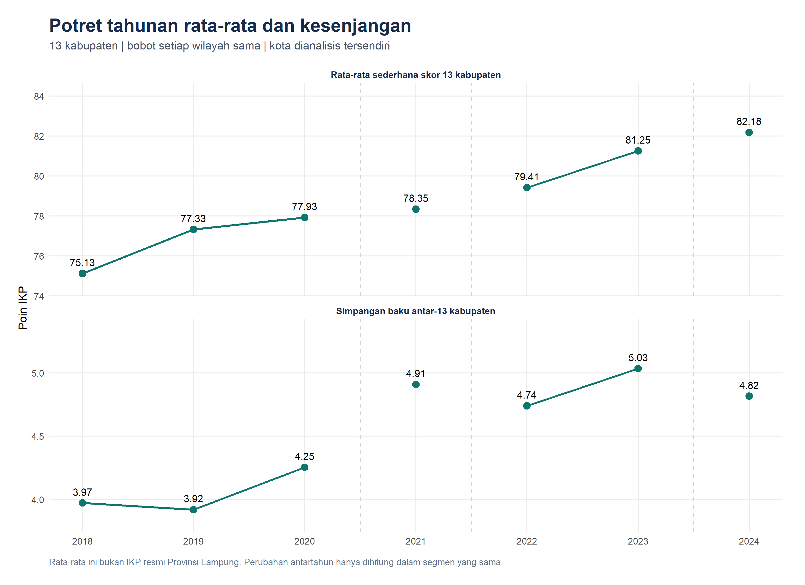
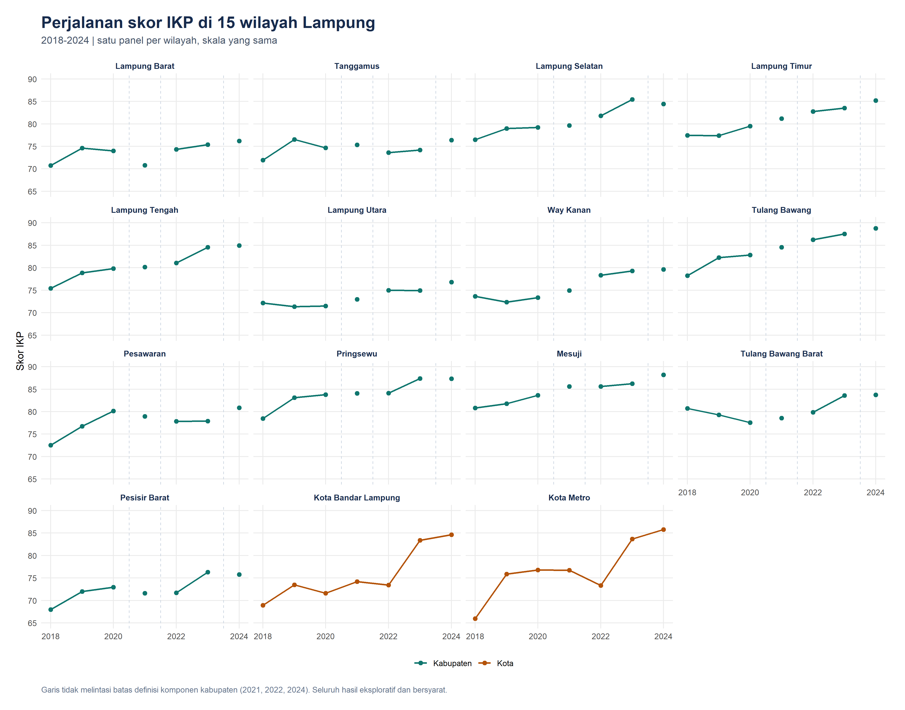
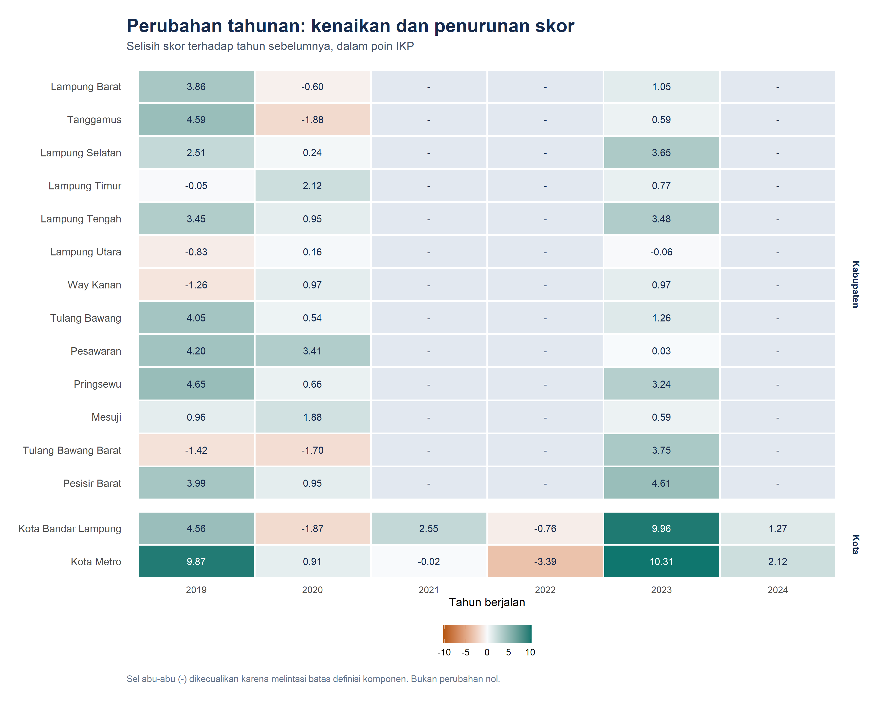
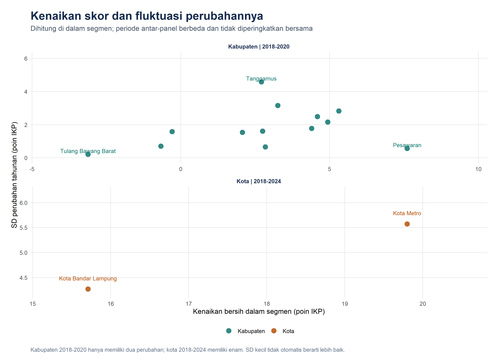
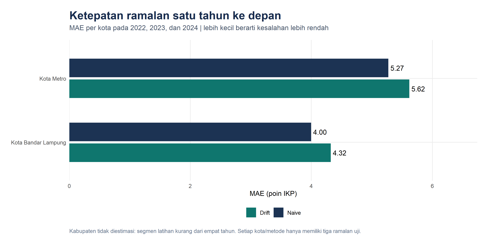
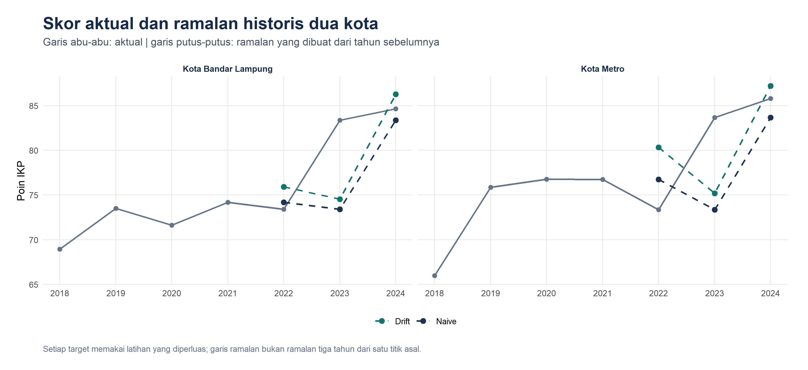

# Analisis Deret Waktu Indeks Ketahanan Pangan Kabupaten/Kota di Lampung

**Tren, Stabilitas Perubahan Skor, dan Kesenjangan, 2018–2024**

Laporan Project Sains Data. Dokumen ini dihasilkan oleh pipeline R dari data yang tersedia; tabel tidak diisi dengan angka perkiraan.

> **Status interpretasi: eksploratif dan bersyarat.** Audit menemukan perubahan rincian komponen ketersediaan pada dokumen tahunan kabupaten. Pipeline memakai batas konservatif pada 2021, 2022, dan 2024. Seluruh skor tetap ditampilkan, tetapi perubahan dan ramalan tidak melintasi batas tersebut. Harmonisasi penuh seri, khususnya metadata 2019 dan rincian teknis 2024, belum terbukti.

## Ringkasan

Data mencakup 105 observasi: 13 kabupaten dan 2 kota, masing-masing tujuh tahun. Data mentah dan CSV bersih asal cocok 105/105. Analisis memakai salinan dengan satu koreksi berbukti primer: Tanggamus 2020, 76,67 menjadi 74,67. Nilai asal tetap tersimpan. Dari 90 kandidat perubahan tahunan, 51 dihitung di dalam segmen dan 39 dikecualikan pada batas definisi komponen.

Dalam segmen kabupaten 2018–2020, rata-rata sederhana skor meningkat dari 75,13 ke 77,93; simpangan baku antarwilayah berubah dari 3,97 ke 4,25. Dalam segmen 2022–2023, rata-rata berubah dari 79,41 ke 81,25 dan simpangan baku dari 4,74 ke 5,03. Angka ini mendeskripsikan skor pada segmen masing-masing; tidak membuktikan perubahan kausal atau keterbandingan penuh antar-edisi.

Evaluasi naïve dan drift menghasilkan 12 ramalan uji untuk dua kota; 78 kandidat kabupaten tidak diestimasi karena segmen latihan kurang dari empat tahun. Metode dengan MAE lebih kecil pada gabungan enam pengamatan uji kota adalah **naive**. Temuan ini terbatas pada dua kota dan tiga tahun target, bukan kesimpulan umum untuk Lampung.

## 1. Pendahuluan

Indeks Ketahanan Pangan (IKP) merupakan skor komposit yang merangkum beberapa indikator ketahanan pangan wilayah. Project ini menggunakan perubahan skor sepanjang waktu untuk memahami perkembangan wilayah, tanpa menaksir pengaruh IPM, kemiskinan, PDRB, atau produksi padi terhadap indeks.

Pertanyaan penelitian:

1. Bagaimana perkembangan skor IKP setiap wilayah dalam periode yang dapat dianalisis?
2. Wilayah mana yang memiliki perubahan skor lebih konsisten atau lebih berfluktuasi?
3. Apakah sebaran skor antarkabupaten menyempit di dalam segmen pengamatan?
4. Bagaimana ketepatan naïve dan drift untuk ramalan satu tahun berikutnya pada seri yang memenuhi syarat?

Istilah **stabilitas** dalam laporan ini hanya berarti kestabilan perubahan skor IKP. Istilah ini tidak mengukur seluruh dimensi stabilitas pangan menurut kerangka ketahanan pangan. Skor yang tidak berubah dapat mencerminkan stagnasi; fluktuasi kecil tidak otomatis lebih baik.

## 2. Data dan audit keterbandingan

Input utama adalah `Data Fix - DATA.csv` dan `data/lampung_panel_clean.csv`. Analisis memakai identitas wilayah, tahun, dan IKP. Dataset berisi 15 seri tahunan pendek, bukan satu seri sepanjang 105 tahun. Kolom `kode` adalah ID internal dan tidak digunakan untuk join ke sumber luar.

### 2.1. Bukti metodologi per tahun

Matriks di bawah merangkum fakta dokumen primer yang berhasil diperiksa dan bagian yang belum selesai. Lokasi halaman, bobot, tahun input, serta catatan per jenis wilayah tersedia di `output/timeseries/audit_metodologi.csv`.

| Edisi | Dokumen | Rincian ketersediaan kabupaten | Batas sebelum edisi | Status bukti |
| --- | --- | --- | --- | --- |
| 2018 | [IKP Indonesia 2018 (PDF lokal dan audit sumber tersimpan)](https://repository.pertanian.go.id/browse/title?scope=6db25a25-f282-4a1b-8271-4cc09bc4d9cb) | Padi, jagung, ubi kayu, ubi jalar | FALSE | metodologi_primer_dan_audit_skor_tersimpan |
| 2019 | [IKP Indonesia 2019 (cuplikan primer terindeks; akses PDF penuh belum berhasil)](https://badanpangan.go.id/storage/app/media/Bahan%202020/IKP%202019%20FINAL.pdf) | Belum terverifikasi | FALSE | cuplikan_primer_terindeks |
| 2020 | [IKP 2020](https://badanpangan.go.id/storage/app/media/2021/ikp-2020-20210120fix.pdf) | Padi, jagung, ubi kayu, ubi jalar | FALSE | terverifikasi_parsial |
| 2021 | [IKP 2021](https://repository.pertanian.go.id/server/api/core/bitstreams/0700d4be-634a-4f89-820c-dbd06fe686b5/content) | Padi, jagung, ubi kayu, ubi jalar, stok beras daerah | TRUE | terverifikasi_parsial |
| 2022 | [IKP 2022](https://badanpangan.go.id/storage/app/media/2023/Buku%20Digital/Buku%20Indeks%20Ketahanan%20Pangan%202022%20Signed.pdf) | Padi, jagung, ubi kayu, ubi jalar, sagu, stok beras daerah | TRUE | terverifikasi_parsial |
| 2023 | [IKP 2023](https://data.badanpangan.go.id/nfs_storage/public/publication/documents/1728546912.pdf) | Padi, jagung, ubi kayu, ubi jalar, sagu, stok beras daerah | FALSE | terverifikasi_parsial |
| 2024 | [Laporan Kinerja Deputi Bidang Kerawanan Pangan dan Gizi 2024](https://esakip.badanpangan.go.id/dok/pk/dok_202541754360657.pdf) | Padi, jagung, ubi kayu, ubi jalar, sagu, stok/CPPD, bantuan pangan CPP | TRUE | terverifikasi_parsial |

Dokumen 2020 menyebut empat komoditas. Dokumen 2021 juga menyebut stok beras daerah; 2022 menambahkan sagu; rincian 2023 masih menyebut sagu dan stok. Laporan resmi 2024 juga menyebut bantuan pangan CPP. Perubahan rincian ini menjadi alasan segmentasi konservatif. Audit tersebut **tidak mengukur dampak numerik perubahan definisi** dan tidak membuktikan bahwa setiap lonjakan skor berasal dari perubahan metode. Identitas normalisasi, implementasi pada setiap daerah, dan backcasting seri belum terverifikasi penuh.

Indeks kota tidak memasukkan komponen ketersediaan. Karena itu, batas yang berasal dari perubahan komponen tersebut tidak langsung diterapkan pada kota. Seri kota tetap bersyarat: tidak ditemukannya batas dari bukti ini bukan bukti bahwa seluruh metode dan sumber inputnya identik.

Segmentasi yang diterapkan:

- Kabupaten: 2018–2020, 2021, 2022–2023, dan 2024. Tahun tunggal tidak dipakai untuk menghitung tren atau stabilitas perubahan.
- Kota: 2018–2024 sebagai satu segmen eksploratif bersyarat.

Skor 2024 versi 12 indikator yang juga tersedia di folder sumber merupakan vintage berbeda dan tidak dicampurkan ke data analisis. Kesamaan jumlah indikator saja tidak membuktikan kesamaan seluruh definisi maupun normalisasi.

### 2.2. Pencocokan dan selisih sumber

Input asal cocok **85/90** dengan sumber provinsi. Kelima selisih memiliki keputusan dan tingkat bukti dalam [catatan rekonsiliasi](review/timeseries/rekonsiliasi_nilai.csv). Tanggamus 2020 dikoreksi pada salinan analisis menjadi 74,67 sesuai Lampiran 1 dan tabel peringkat [publikasi primer IKP 2020](https://badanpangan.go.id/storage/app/media/2021/ikp-2020-20210120fix.pdf). Empat nilai lainnya dipertahankan karena didukung publikasi primer atau dokumen pemerintah daerah; dua keputusan berbukti cuplikan terindeks tetap memiliki keterbatasan akses. Sesudah rekonsiliasi, **86/90** nilai analisis cocok dengan provinsi; empat selisih tersisa bukan koreksi yang tertunda secara otomatis.

| Wilayah | Tahun | Nilai asal | Provinsi | Nilai analisis | Keputusan | Bukti |
| --- | --- | ---: | ---: | ---: | --- | --- |
| Lampung Barat | 2020 | 74,02 | 70,80 | 74,02 | pertahankan | primer_pdf |
| Tanggamus | 2020 | 76,67 | 74,67 | 74,67 | koreksi | primer_pdf |
| Kota Metro | 2019 | 75,85 | 78,00 | 75,85 | pertahankan | dokumen_daerah_dan_indeks_primer |
| Kota Metro | 2020 | 76,76 | 76,75 | 76,76 | pertahankan | primer_pdf |
| Lampung Selatan | 2024 | 84,46 | 84,64 | 84,46 | pertahankan | dokumen_daerah_terindeks |

Selisih sesudah rekonsiliasi:

| Wilayah | Tahun | IKP proyek | IKP sumber provinsi | Selisih (poin) |
| --- | --- | ---: | ---: | ---: |
| Lampung Barat | 2020 | 74,02 | 70,80 | 3,22 |
| Lampung Selatan | 2024 | 84,46 | 84,64 | -0,18 |
| Kota Metro | 2019 | 75,85 | 78,00 | -2,15 |
| Kota Metro | 2020 | 76,76 | 76,75 | 0,01 |

Untuk IKP 2018, audit skor tersimpan mencatat 15/15 cocok dengan publikasi primer, termasuk peringkat. Metodologi PDF lokal berhasil diperiksa ulang: produksi tetap 2014–2016, Susenas 2017, bobot 9/8 indikator, dan rumus umum standardisasi. Pemeriksaan ini tidak membuktikan parameter normalisasi identik lintas-edisi. Pencocokan provinsi dilakukan lewat nama wilayah dengan menghapus awalan `Kota`, bukan lewat ID internal.

### 2.3. Sensitivitas terhadap pilihan nilai

Tiga skenario dihitung tanpa mengubah input: nilai asal; nilai rekonsiliasi (analisis utama); dan semua nilai pembanding provinsi sebagai uji sensitivitas. Skenario provinsi bukan rekomendasi penggantian data: publikasi primer justru mendukung beberapa nilai asal. Perubahan urutan wilayah berikut menunjukkan ketergantungan ukuran fluktuasi pada pilihan sumber.

| Skenario | Rata-rata kabupaten 2020 | SD kabupaten 2020 | Wilayah SD perubahan tertinggi 2018–2020 | SD perubahan tertinggi | MAE naïve kota | MAE drift kota |
| --- | ---: | ---: | --- | ---: | ---: | ---: |
| asli | 78,08 | 4,16 | Tanggamus | 3,16 | 4,64 | 4,97 |
| rekonsiliasi | 77,93 | 4,25 | Tanggamus | 4,57 | 4,64 | 4,97 |
| pembanding_provinsi | 77,68 | 4,58 | Lampung Barat | 5,43 | 4,64 | 4,97 |

## 3. Metode analisis deret waktu

### 3.1. Tren dan perubahan

Untuk tiap wilayah dan segmen, perubahan tahunan dihitung sebagai `IKP(t) − IKP(t−1)`. Kenaikan bersih adalah skor terakhir dikurangi skor awal segmen. Rata-rata perubahan adalah rata-rata selisih tahunan. Semua ukuran dinyatakan dalam poin IKP, bukan persen. Perubahan pada batas metodologi disimpan sebagai nilai kosong dengan alasan pengecualian.

### 3.2. Stabilitas dan kesenjangan

Fluktuasi diukur dengan **simpangan baku sampel perubahan tahunan** (`sd(diff(IKP))`), hanya jika tersedia minimal dua perubahan. Jumlah tahun turun serta perubahan terbesar dan terkecil dilaporkan bersama kenaikan bersih. Dua tahun hanya menyediakan satu perubahan sehingga SD tidak dihitung.

Kesenjangan menggunakan simpangan baku sampel dan rentang skor 13 kabupaten pada setiap tahun. Rata-ratanya memberi bobot sama pada tiap kabupaten dan **bukan IKP resmi Provinsi Lampung**. Perubahan rata-rata maupun SD hanya dihitung antara tahun bersebelahan dalam segmen yang sama. Tidak ada uji signifikansi tren atau pemeringkatan lintas-segmen dengan panjang berbeda.

### 3.3. Evaluasi peramalan tambahan

Naïve memakai skor terakhir sebagai ramalan satu tahun berikutnya. Drift menambahkan `(skor terakhir − skor pertama)/(n−1)` pada skor terakhir, menggunakan hanya nilai latihan dalam segmen yang sama. Ini dua metode sederhana yang dapat menjadi pembanding peramalan. [Forecasting: Principles and Practice — metode sederhana](https://otexts.com/fpp3/simple-methods.html)

Tahun target ditetapkan 2022, 2023, dan 2024. Latihan diperluas sampai tahun sebelumnya dan disyaratkan minimal empat titik dalam segmen target. Tanpa batas, latihan akan berupa 2018–2021, 2018–2022, dan 2018–2023; batas metodologi mengurangi latihan kabupaten menjadi terlalu pendek. Data tahun target dan masa depan tidak digunakan untuk membentuk ramalan. [Evaluasi dengan rolling forecasting origin](https://otexts.com/fpp3/tscv.html)

Error didefinisikan sebagai aktual dikurangi ramalan. **MAE = mean(abs(error))** menjadi ukuran utama, **RMSE = sqrt(mean(error²))** sebagai pelengkap. Agregasi kota memakai enam error per metode (dua kota × tiga target); tidak digabung dengan kabupaten yang tidak diestimasi. MAE dan RMSE dinyatakan dalam poin IKP. [Evaluasi ketepatan ramalan](https://otexts.com/fpp3/accuracy.html)

Tidak ada pemilihan model kompleks, penyetelan berdasarkan tahun target, pemotongan ramalan ke skala 0–100, atau proyeksi jauh ke depan. Ramalan di luar skala akan ditandai dalam CSV. Evaluasi hanya mencakup ramalan historis yang dapat dibandingkan dengan aktual.

## 4. Hasil dan pembahasan

### 4.1. Potret tahunan 13 kabupaten

| Tahun | Rata-rata | SD | Minimum | Maksimum | Rentang | Segmen |
| --- | ---: | ---: | ---: | ---: | ---: | --- |
| 2018 | 75,13 | 3,97 | 67,99 | 80,82 | 12,83 | Kabupaten_1 |
| 2019 | 77,33 | 3,92 | 71,35 | 83,13 | 11,78 | Kabupaten_1 |
| 2020 | 77,93 | 4,25 | 71,51 | 83,79 | 12,28 | Kabupaten_1 |
| 2021 | 78,35 | 4,91 | 70,80 | 85,60 | 14,80 | Kabupaten_2 |
| 2022 | 79,41 | 4,74 | 71,71 | 86,25 | 14,54 | Kabupaten_3 |
| 2023 | 81,25 | 5,03 | 74,19 | 87,51 | 13,32 | Kabupaten_3 |
| 2024 | 82,18 | 4,82 | 75,77 | 88,78 | 13,01 | Kabupaten_4 |

Angka antar-edisi ditampilkan sebagai potret skor yang tercatat. Perubahan lintas-batas tidak dihitung sebagai tren yang sebanding. Kota tidak masuk tabel rata-rata ini.



### 4.2. Tren per wilayah dan segmen

**Kabupaten 2018–2020.** Setiap wilayah memiliki tiga skor dan dua perubahan. Ini ukuran deskriptif dengan informasi sangat terbatas; tidak dipakai untuk klasifikasi stabil/tidak stabil. Cuplikan primer 2019 mendukung jumlah indikator dan rumus umum, tetapi audit penuh keterbandingan input belum selesai.

| Wilayah | IKP awal | IKP akhir | Kenaikan (poin) | Rata-rata perubahan | SD perubahan | Tahun turun |
| --- | ---: | ---: | ---: | ---: | ---: | --- |
| Lampung Barat | 70,76 | 74,02 | 3,26 | 1,63 | 3,15 | 1 |
| Tanggamus | 71,96 | 74,67 | 2,71 | 1,36 | 4,57 | 1 |
| Lampung Selatan | 76,48 | 79,23 | 2,75 | 1,38 | 1,61 | 0 |
| Lampung Timur | 77,43 | 79,50 | 2,07 | 1,03 | 1,53 | 1 |
| Lampung Tengah | 75,43 | 79,83 | 4,40 | 2,20 | 1,77 | 0 |
| Lampung Utara | 72,18 | 71,51 | -0,67 | -0,34 | 0,70 | 1 |
| Way Kanan | 73,63 | 73,34 | -0,29 | -0,14 | 1,58 | 1 |
| Tulang Bawang | 78,24 | 82,83 | 4,59 | 2,30 | 2,48 | 0 |
| Pesawaran | 72,54 | 80,15 | 7,61 | 3,80 | 0,56 | 0 |
| Pringsewu | 78,48 | 83,79 | 5,31 | 2,66 | 2,82 | 0 |
| Mesuji | 80,82 | 83,66 | 2,84 | 1,42 | 0,65 | 0 |
| Tulang Bawang Barat | 80,70 | 77,58 | -3,12 | -1,56 | 0,20 | 2 |
| Pesisir Barat | 67,99 | 72,93 | 4,94 | 2,47 | 2,15 | 0 |

**Kabupaten 2022–2023.** Setiap wilayah hanya memiliki satu perubahan; simpangan baku perubahan tidak tersedia. Skor 2021 dan 2024 ditampilkan pada grafik dan CSV, tetapi tidak diberi nilai tren dari satu titik.

| Wilayah | IKP awal | IKP akhir | Kenaikan (poin) | Rata-rata perubahan | SD perubahan | Tahun turun |
| --- | ---: | ---: | ---: | ---: | ---: | --- |
| Lampung Barat | 74,34 | 75,39 | 1,05 | 1,05 | — | 0 |
| Tanggamus | 73,60 | 74,19 | 0,59 | 0,59 | — | 0 |
| Lampung Selatan | 81,81 | 85,46 | 3,65 | 3,65 | — | 0 |
| Lampung Timur | 82,78 | 83,55 | 0,77 | 0,77 | — | 0 |
| Lampung Tengah | 81,07 | 84,55 | 3,48 | 3,48 | — | 0 |
| Lampung Utara | 75,00 | 74,94 | -0,06 | -0,06 | — | 1 |
| Way Kanan | 78,34 | 79,31 | 0,97 | 0,97 | — | 0 |
| Tulang Bawang | 86,25 | 87,51 | 1,26 | 1,26 | — | 0 |
| Pesawaran | 77,86 | 77,89 | 0,03 | 0,03 | — | 0 |
| Pringsewu | 84,14 | 87,38 | 3,24 | 3,24 | — | 0 |
| Mesuji | 85,62 | 86,21 | 0,59 | 0,59 | — | 0 |
| Tulang Bawang Barat | 79,84 | 83,59 | 3,75 | 3,75 | — | 0 |
| Pesisir Barat | 71,71 | 76,32 | 4,61 | 4,61 | — | 0 |

**Dua kota 2018–2024.** Keenam perubahan dapat dihitung secara eksploratif di bawah asumsi keterbandingan seri kota.

| Wilayah | IKP awal | IKP akhir | Kenaikan (poin) | Rata-rata perubahan | SD perubahan | Tahun turun |
| --- | ---: | ---: | ---: | ---: | ---: | --- |
| Kota Bandar Lampung | 68,93 | 84,64 | 15,71 | 2,62 | 4,27 | 2 |
| Kota Metro | 65,98 | 85,78 | 19,80 | 3,30 | 5,57 | 2 |





### 4.3. Stabilitas perubahan skor

Pada segmen kabupaten 2018–2020, SD perubahan terendah tercatat pada **Tulang Bawang Barat (0,20 poin)** dan tertinggi pada **Tanggamus (4,57 poin)**. Ukuran tersebut berasal dari hanya dua perubahan per wilayah sehingga dipakai sebagai deskripsi, bukan klasifikasi risiko atau bukti pola jangka panjang.

Kenaikan bersih dan fluktuasi dibaca bersama: kenaikan yang konsisten berbeda dari stagnasi, walaupun keduanya dapat memiliki SD rendah. Kabupaten dan kota tidak digabung dalam pemeringkatan stabilitas karena jumlah perubahan dan konstruksi indeks berbeda.



### 4.4. Apakah kesenjangan menyempit?

Di dalam segmen 2018–2020, SD antarkabupaten berubah dari 3,97 ke 4,25, selisih **0,28 poin**. Di dalam segmen 2022–2023, SD berubah dari 4,74 ke 5,03, selisih **0,29 poin**. Pada kedua perbandingan ujung segmen ini, sebaran skor tidak menyempit; ini deskripsi data, bukan uji perbedaan populasi.

Pertanyaan apakah kesenjangan sepanjang 2018–2024 menyempit **belum dapat dijawab secara sebanding** dari seri ini tanpa harmonisasi komponen. Karena itu, laporan tidak mengurangkan potret 2018 langsung dari potret 2024 untuk menyatakan perubahan kesenjangan seluruh periode.

### 4.5. Ketepatan peramalan sederhana

| Jenis wilayah | Metode | Ramalan dihitung | Tahun uji | MAE (poin) | RMSE (poin) |
| --- | --- | --- | --- | ---: | ---: |
| Kabupaten | drift | 0 | 0 | — | — |
| Kabupaten | naive | 0 | 0 | — | — |
| Kota | drift | 6 | 3 | 4,97 | 5,91 |
| Kota | naive | 6 | 3 | 4,64 | 6,11 |

Nilai kosong untuk kabupaten berarti **tidak diestimasi**, bukan error nol. Semua 78 kandidat kabupaten (13 × 3 × 2) tersimpan dengan alasan pengecualian pada tabel backtest. Hasil per kota:

| Wilayah | Metode | Ramalan uji | MAE (poin) | RMSE (poin) |
| --- | --- | --- | ---: | ---: |
| Kota Bandar Lampung | drift | 3 | 4,32 | 5,39 |
| Kota Bandar Lampung | naive | 3 | 4,00 | 5,81 |
| Kota Metro | drift | 3 | 5,62 | 6,39 |
| Kota Metro | naive | 3 | 5,27 | 6,38 |

Hasil per tahun target, masing-masing dari dua kota:

| Target | Metode | Ramalan uji | MAE (poin) | RMSE (poin) |
| --- | --- | --- | ---: | ---: |
| 2022 | drift | 2 | 4,74 | 5,24 |
| 2022 | naive | 2 | 2,08 | 2,46 |
| 2023 | drift | 2 | 8,65 | 8,66 |
| 2023 | naive | 2 | 10,14 | 10,14 |
| 2024 | drift | 2 | 1,52 | 1,52 |
| 2024 | naive | 2 | 1,70 | 1,75 |

Metode **naive** memiliki MAE gabungan kota yang lebih rendah pada pengujian ini. Besarnya error per tahun harus ikut dibaca karena lonjakan skor dapat mendominasi ringkasan. Tiga target tidak cukup untuk menyatakan metode terbaik secara umum, apalagi untuk kabupaten yang tidak diestimasi.

Menurut RMSE gabungan, metode dengan nilai lebih rendah adalah **drift**. Pemilihan ukuran error mengubah urutan metode; laporan tidak menetapkan pemenang universal.

### 4.6. Sensitivitas terhadap tahun target

Evaluasi diulang dengan mengeluarkan satu tahun target secara bergantian. Setiap skenario pengurangan tahun hanya memiliki empat ramalan per metode dari dua tahun target. Ini pemeriksaan deskriptif ketahanan hasil; bukan uji signifikansi atau penyetelan model. Kesimpulan pilihan metode harus mempertimbangkan perubahan urutan MAE/RMSE dan tidak menganggap enam error sebagai enam tahun independen.

| Skenario | Metode | Ramalan uji | Tahun uji | MAE | RMSE |
| --- | --- | --- | --- | ---: | ---: |
| semua_target | drift | 6 | 3 | 4,97 | 5,91 |
| semua_target | naive | 6 | 3 | 4,64 | 6,11 |
| tanpa_target_2022 | drift | 4 | 2 | 5,09 | 6,21 |
| tanpa_target_2022 | naive | 4 | 2 | 5,92 | 7,27 |
| tanpa_target_2023 | drift | 4 | 2 | 3,13 | 3,86 |
| tanpa_target_2023 | naive | 4 | 2 | 1,89 | 2,13 |
| tanpa_target_2024 | drift | 4 | 2 | 6,70 | 7,16 |
| tanpa_target_2024 | naive | 4 | 2 | 6,11 | 7,38 |





## 5. Keterbatasan dan kesimpulan

1. Panjang seri hanya tujuh tahun; segmentasi memperpendeknya lagi. Analisis tidak mengidentifikasi pola musiman bulanan atau siklus jangka panjang.
2. Perubahan dokumen komponen tidak memberi ukuran dampak pada skor. Batas konservatif mencegah perbandingan lintas-definisi, tetapi tidak menggantikan seri yang telah diharmonisasi.
3. Metodologi 2019 dan rincian lengkap 2024 belum selesai diverifikasi. Sumber input dan normalisasi yang berganti dapat memengaruhi skor, termasuk seri kota.
4. Lima perbedaan sumber sudah memiliki keputusan terdokumentasi; satu koreksi memakai publikasi primer. Keputusan Metro 2019 dan Lampung Selatan 2024 masih memakai cuplikan terindeks/dokumen daerah sehingga kekuatan bukti dibedakan. Uji sensitivitas menunjukkan kesimpulan fluktuasi bergantung pada nilai sumber.
5. Evaluasi ramalan hanya menghasilkan tiga target per kota. Keenam error gabungan per metode tidak dianggap sebagai enam tahun observasi independen.
6. Perubahan skor tidak membuktikan pengaruh kebijakan, COVID, atau faktor sosial-ekonomi tertentu. Hasil tidak digunakan sebagai peringkat prioritas intervensi.

Kesimpulan project adalah bahwa perkembangan dan fluktuasi **skor yang tercatat** dapat dideskripsikan dalam segmen eksploratif yang ditetapkan. Peningkatan rata-rata dalam dua segmen kabupaten tidak disertai penyempitan SD pada ujung segmen. Dua kota menyediakan ilustrasi evaluasi ramalan sederhana. Jawaban tren dan kesenjangan penuh 2018–2024, serta peramalan kabupaten yang sebanding, memerlukan konfirmasi harmonisasi atau tambahan seri yang konsisten.

## 6. Reproduksi dan berkas hasil

Jalankan dari root project di PowerShell:

```powershell
& "C:/Program Files/R/R-4.5.2/bin/Rscript.exe" --vanilla R/timeseries/run.R
```

Pipeline memakai base R dan ggplot2 yang telah terpasang. Tidak memerlukan jaringan atau pemasangan package. Pipeline menjalankan pemeriksaan rumus, kebocoran waktu, batas metodologi, data invalid, integritas input, serta kelengkapan ekspor sebelum menyatakan selesai.

Penyiapan komputer baru dijelaskan di [README](README.md): R 4.5.2, versi paket dikunci dalam renv.lock, dan restore eksplisit ke .library/. Versi paket diperiksa terhadap manifest sebelum analisis. Workflow GitHub Actions menguji clone bersih pada Windows dan Linux; status eksekusi CI dilihat di tab Actions repo, tidak diasumsikan lulus hanya karena workflow tersedia.

Berkas di `output/timeseries/`:

- `data_analisis.csv`: 105 skor, jenis wilayah, segmen, dan status analisis.
- `audit_metodologi.csv`: bukti per edisi dan jenis wilayah; `audit_sumber_provinsi.csv` serta `selisih_sumber_provinsi.csv`: audit nilai sumber.
- `audit_sumber_provinsi_asal.csv` dan `rekonsiliasi_nilai.csv`: perbandingan sebelum koreksi dan seluruh keputusan sumber; `sensitivitas_nilai.csv` serta `sensitivitas_tahun_uji.csv`: ketahanan hasil.
- `perubahan_tahunan.csv`: seluruh kandidat perubahan termasuk nilai yang dikecualikan; `ringkasan_wilayah_per_segmen.csv`: ukuran tren dan fluktuasi.
- `kesenjangan_kabupaten.csv`: potret tahunan serta perubahan yang memenuhi batas.
- `backtest_detail.csv`: seluruh kandidat ramalan, jendela latihan, aktual, error, dan status.
- `akurasi_per_wilayah.csv`, `akurasi_per_jenis_wilayah.csv`, `akurasi_per_tahun.csv`: ukuran ketepatan.
- Enam grafik dalam format PNG 300 dpi dan PDF.
- `hash_input_sha256.csv`, `integritas_arsip.csv`, `versi_kode.csv`, `session_info.txt`, dan `run.log`: bukti reproduksi dan integritas.

Hash SHA256 input: kolom byte menunjukkan berkas lokal; kolom teks LF menjadi acuan integritas yang hanya menormalkan CRLF ke LF. Perubahan angka/isi lain tetap ditolak. .gitattributes menetapkan CSV sebagai teks LF agar clone memiliki format konsisten.

| Input | SHA256 byte lokal | SHA256 teks LF |
| --- | --- | --- |
| Data Fix - DATA.csv | ad69f257005795e69fe56006f32e913e8231777a6cb66bcb40782cdd7eea0eb5 | 45aed9ed91043495c9edd63dca80db0af9039bbe6362a17aa541630ab1d41196 |
| data/lampung_panel_clean.csv | becc5801facc6ee6f04a5d1906646a71eaa9e0c45c3cb45c22e6febb506a8431 | 0812042e7fba6261edc03ffc483eea73191c22e9fe0715d73be297eb8aa6c3f1 |

Angka CSV disimpan dengan presisi perhitungan R; laporan menampilkan dua desimal. Selisih kecil akibat pembulatan tabel tidak mengubah perhitungan. Pipeline panel lama dan kedua laporan lama dipertahankan sebagai arsip, bukan sumber kesimpulan deret waktu ini.

## Referensi metode

Hyndman, R. J. & Athanasopoulos, G. *Forecasting: Principles and Practice*, edisi ketiga: [metode sederhana](https://otexts.com/fpp3/simple-methods.html), [evaluasi ketepatan](https://otexts.com/fpp3/accuracy.html), [evaluasi berbasis urutan waktu](https://otexts.com/fpp3/tscv.html), dan [seri pendek](https://otexts.com/fpp3/long-short-ts.html). Referensi publikasi IKP tercantum pada matriks sumber di bagian 2.
